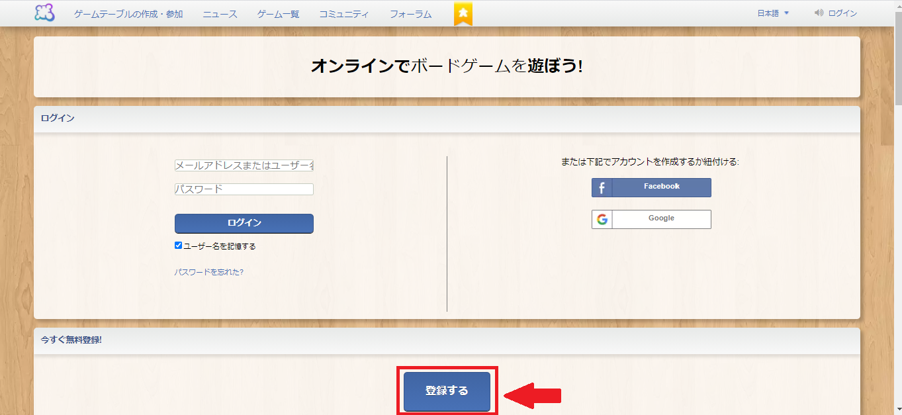
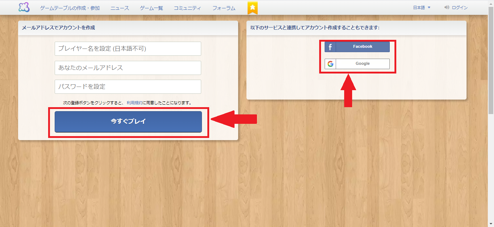

# オンラインボードゲームの始め方

## 1. アカウントを作成する

### 1-1. サイトへアクセス

まずは『ボードゲームアリーナ』というサイトでアカウントの作成を行っていただきます。
下記のURLからサイトへアクセスしてください。

オンラインでボードゲームを遊ぼう! ・ Board Game Arena  
https://ja.boardgamearena.com/welcome

### 1-2. アカウント登録

トップ画面から『登録する』をクリックしてください。

『メールアドレスでアカウントを作成』あるいは『以下のサービスと連携してアカウント作成』
のどちらかを選んで各種情報を登録してください。

---

#### 1-2-1. 『メールアドレスでアカウントを作成』の場合

登録が完了しましたら、登録したメールアドレスにメールが届きますので、
メール内のリンクをクリックして、初期で掛けられているアカウントのロックを解除してください。

ロック解除が完了しましたらアカウント作成の完了です！

---

#### 1-2-2. 『以下のサービスと連携してアカウント作成』の場合

メールアドレスやパスワードを入力して連携した後、プレイヤー名を入力するとアカウント作成の完了です！

# 以上で、ゲームが開始できる状態です！！！

## 2. その他

ご不明点等ございましたら、
人事部の奥原の個人 LINE 宛にご連絡ください。
